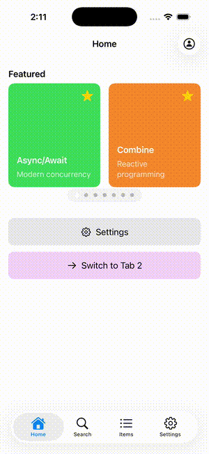
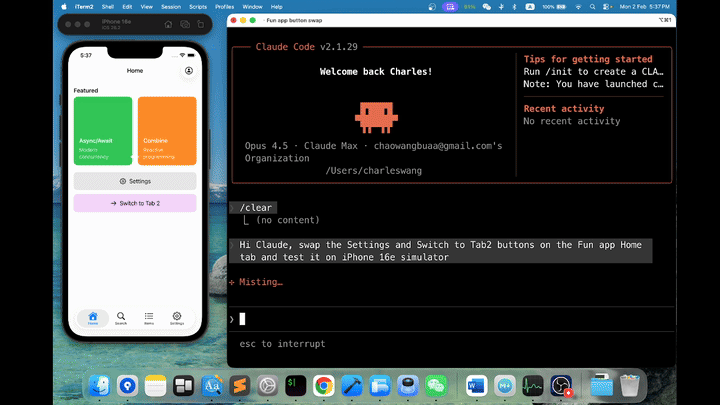

# Fun - iOS Demo App

A modern iOS application demonstrating clean architecture principles, modular design with Swift Package Manager, and best practices for scalable iOS development.

## Demo



## Projects/Modules

The workspace contains the following sub-projects:

| Project | Provides |
|---------|----------|
| Application | FunApp.app (iOS application entry point) |
| App | AppCore.framework |
| UI | FunUI.framework |
| Coordinator | FunCoordinator.framework |
| Services | FunServices.framework |
| ViewModel | FunViewModel.framework |
| Model | FunModel.framework |
| Core | FunCore.framework |

Each project (except for Application) defines a single `.framework` (and accompanying unit tests). These modules/frameworks are designed to fit together in a particular structure.

## Module Dependency Hierarchy

```
                    ┌─────────────────────────┐
                    │     FunApplication      │
                    └─────────────────────────┘
                                │
                    ┌───────────┴───────────┐
                    ▼                       ▼
            ┌─────────────┐         ┌─────────────┐
            │ Coordinator │         │  Services   │
            └─────────────┘         └─────────────┘
                    │                       │
                    ▼                       │
            ┌─────────────┐                 │
            │     UI      │                 │
            └─────────────┘                 │
                    │                       │
                    ▼                       │
            ┌─────────────┐                 │
            │  ViewModel  │◄────────────────┘
            └─────────────┘
                    │
                    ▼
            ┌─────────────┐
            │    Model    │
            └─────────────┘
                    │
                    ▼
            ┌─────────────┐
            │    Core     │
            └─────────────┘
                    │
                    ▼
            ┌─────────────┐
            │   Apple     │
            │  Platform   │
            └─────────────┘
```

**Dependency Summary:**
- Coordinator → UI, ViewModel, Model, Core
- UI → ViewModel, Model, Core
- Services → Model, Core
- ViewModel → Model, Core
- Model → Core

Modules higher in this stack should only `import` (and link with) modules lower in the stack. For example, code in the `FunServices` can, and should, import `FunModel` & `FunCore` in addition to any appropriate frameworks provided by the platform.

## Directory Structure

```
Fun/
├── Application/           # Xcode project (entry point)
│   ├── FunApp/           # App target source files
│   ├── FunAppTests/      # Unit tests
│   └── FunAppUITests/    # UI tests
├── Coordinator/          # Navigation coordinators
│   └── Sources/Coordinator/
├── Model/                # Data models & protocols
│   └── Sources/Model/
│       ├── Coordinators/ # Coordinator protocols
│       ├── Services/     # Service protocols
│       └── Mocks/        # Mock implementations
├── Services/             # Concrete service implementations
│   └── Sources/Services/
│       └── CoreServices/ # Default implementations
├── Core/                 # Utilities, DI container & L10n
│   └── Sources/Core/
│       ├── Generated/    # SwiftGen generated strings
│       └── Resources/    # Localizable.strings
├── UI/                   # SwiftUI views & UIKit controllers
│   └── Sources/UI/
│       ├── Home/         # Home tab (carousel)
│       ├── Items/        # Items tab (search + list)
│       ├── Settings/     # Settings tab
│       ├── Detail/       # Detail screens
│       ├── Profile/      # Profile modal
│       └── Extensions/   # UIKit extensions
├── ViewModel/            # Business logic (MVVM)
│   └── Sources/ViewModel/
├── App/                  # SPM package for app-level code
└── Documentation/        # Project documentation
```

## Design Patterns

### 1. MVVM + Coordinator
- **ViewModel**: Handles business logic, state management, and data transformation
- **View**: Pure UI representation (SwiftUI) with no business logic
- **Coordinator**: Manages navigation flow and screen transitions

### 2. Dependency Injection via ServiceLocator
```swift
// Registration (in SceneDelegate)
ServiceLocator.shared.register(DefaultNetworkService(), for: .network)

// Resolution via property wrapper
@Service(.network) var networkService: NetworkService
```

### 3. Protocol-Oriented Design
- All services defined as protocols in `Model` package
- Concrete implementations in `Services` package
- Enables easy mocking and testing

```swift
// Protocol (Model package)
protocol NetworkService {
    func fetch<T: Decodable>(_ endpoint: String) async throws -> T
}

// Implementation (Services package)
class DefaultNetworkService: NetworkService { ... }

// Mock (for testing)
class MockNetworkService: NetworkService { ... }
```

### 4. Coordinator Pattern
```swift
protocol HomeCoordinator: AnyObject {
    func showDetail(for item: FeaturedItem)
    func showProfile()
}

class HomeCoordinatorImpl: BaseCoordinator, HomeCoordinator {
    func showDetail(for item: FeaturedItem) {
        let coordinator = DetailCoordinatorImpl(...)
        let viewModel = DetailViewModel(item: item, coordinator: coordinator)
        safePush(DetailViewController(viewModel: viewModel))
    }
}
```

## Data Flow & System Dependencies

```
┌─────────────────────────────────────────────────────────────────────────────┐
│                              User Interaction                               │
│                        (Tap, Scroll, Pull-to-Refresh)                       │
└─────────────────────────────────────────────────────────────────────────────┘
                                      │
                                      ▼
┌─────────────────────────────────────────────────────────────────────────────┐
│                                 UI Layer                                    │
│                   (SwiftUI Views, UIKit ViewControllers)                    │
│                                                                             │
│   • HomeView - Featured carousel with 14 technology items                   │
│   • ItemsView - Search bar, category filter, items list with favorites      │
│   • SettingsView - Feature toggles, app configuration                       │
└─────────────────────────────────────────────────────────────────────────────┘
                                      │
                         ┌────────────┴────────────┐
                         │   @ObservedObject       │
                         ▼                         ▼
┌─────────────────────────────────┐   ┌───────────────────────────────────────┐
│         ViewModel Layer          │   │           Coordinator Layer            │
│                                  │   │                                        │
│  • Business logic                │   │  • Navigation flow control             │
│  • State management              │◄──│  • Screen transitions                  │
│  • Data transformation           │   │  • Deep linking support                │
│  • Combine publishers            │   │  • Child coordinator management        │
│  • Async/await operations        │   │                                        │
└─────────────────────────────────┘   └───────────────────────────────────────┘
                         │
                         ▼
┌─────────────────────────────────────────────────────────────────────────────┐
│                              Services Layer                                 │
│                                                                             │
│   NetworkService ───────► API calls (simulated)                             │
│   FavoritesService ─────► UserDefaults persistence                          │
│   FeatureToggleService ─► Runtime feature flags                             │
│   LoggerService ────────► Console logging                                   │
│   ToastService ─────────► In-app notifications                              │
└─────────────────────────────────────────────────────────────────────────────┘
                         │
                         ▼
┌─────────────────────────────────────────────────────────────────────────────┐
│                               Model Layer                                   │
│                                                                             │
│   • FeaturedItem (14 technology showcase items with descriptions)           │
│   • Service protocols (NetworkService, FavoritesService, etc.)              │
│   • Coordinator protocols (HomeCoordinator, ItemsCoordinator, etc.)         │
│   • Mock implementations for testing                                        │
└─────────────────────────────────────────────────────────────────────────────┘
                         │
                         ▼
┌─────────────────────────────────────────────────────────────────────────────┐
│                               Core Layer                                    │
│                                                                             │
│   • ServiceLocator (Dependency injection container)                         │
│   • @Service property wrapper                                               │
│   • L10n (Type-safe localized strings via SwiftGen)                         │
│   • ObjectIdentityEquatable/Hashable utilities                              │
└─────────────────────────────────────────────────────────────────────────────┘
```

## Key Features

### Reactive Data Flow
- **Combine** framework for reactive programming
- `@Published` properties for automatic UI updates
- Debounced search with minimum character validation

### Feature Toggles
- Runtime feature flag management
- Persisted via UserDefaults
- Combine publishers for reactive cross-component updates

```swift
// Toggle carousel visibility at runtime
featureToggleService.featuredCarousel = false  // Instantly hides carousel

// Observe changes via Combine
featureToggleService.featureTogglesDidChange
    .sink { /* update UI */ }
    .store(in: &cancellables)
```

### Modern Search Implementation
- Bottom search bar (iOS 18+ style)
- Debounced input (400ms)
- Minimum character requirement (2 chars)
- Loading state with spinner
- Cancel button on focus

### Pull-to-Refresh
- Native SwiftUI `.refreshable` modifier
- Async/await for clean async code
- Simulated network delay for realistic UX

## Tech Stack

| Category | Technology |
|----------|------------|
| Language | Swift 6.0 |
| UI Framework | SwiftUI + UIKit |
| Reactive | Combine |
| Architecture | MVVM + Coordinator |
| Dependency Injection | ServiceLocator + Property Wrapper |
| Package Management | Swift Package Manager |
| Minimum iOS | iOS 15.0 |
| Testing | Swift Testing, XCTest |
| Snapshot Testing | swift-snapshot-testing |
| Logging | OSLog |
| Localization | SwiftGen |
| Linting | SwiftLint |
| CI/CD | GitHub Actions |

## Testing Strategy

### Unit Tests
- **ViewModel Tests**: Business logic validation
- **Service Tests**: Service behavior verification
- **Mock Objects**: Protocol-based mocking

```swift
@Test func searchFiltersResultsByText() async {
    let viewModel = ItemsViewModel(coordinator: nil)
    viewModel.searchText = "swift"

    #expect(viewModel.items.count == 1)
    #expect(viewModel.items.first?.title == "Swift Concurrency")
}
```

### Snapshot Tests
- Visual regression testing for UI components
- Multiple device configurations
- Light/dark mode variants

## Project Highlights

### Clean Architecture Benefits
- **Testability**: Each layer can be tested in isolation
- **Maintainability**: Changes in one module don't affect others
- **Scalability**: Easy to add new features or modules
- **Reusability**: Modules can be shared across projects

### Swift 6 Compatibility
- `@MainActor` for thread-safe UI updates
- Structured concurrency with async/await
- Sendable conformance where required

### UIKit + SwiftUI Interoperability
```swift
// Embedding SwiftUI in UIKit
extension UIViewController {
    func embedSwiftUIView<Content: View>(_ content: Content) {
        let hostingController = UIHostingController(rootView: content)
        addChild(hostingController)
        view.addSubview(hostingController.view)
        // ... constraints
    }
}
```

## Getting Started

### Requirements
- Xcode 16.0+
- iOS 15.0+
- Swift 6.0

### Installation
```bash
git clone https://github.com/g-enius/Fun.git
cd Fun
open Fun.xcworkspace
```

### Running the App
1. Open `Fun.xcworkspace` in Xcode
2. Select the `FunApp` scheme
3. Choose a simulator (iPhone 17 Pro recommended)
4. Press `Cmd + R` to build and run

### Running Tests
```bash
# Unit tests
xcodebuild test -workspace Fun.xcworkspace -scheme FunApp -destination 'platform=iOS Simulator,name=iPhone 17 Pro'
```

## Code Quality

- **No force unwraps** in production code
- **Protocol-first** design for all services
- **Consistent naming** conventions throughout
- **Comprehensive documentation** for public APIs
- **SOLID principles** adherence

### SwiftLint

Strict linting with custom rules:
```bash
swiftlint lint
```

Key rules enabled:
- `force_unwrapping` - No force unwraps allowed
- `implicitly_unwrapped_optional` - Explicit optionals only
- Custom `no_print` rule - Use Logger instead of print()

### GitHub Actions CI

Automated pipeline on every push/PR:
- SwiftLint check
- Build all SPM packages
- Run unit tests
- Build iOS app for simulator

### OSLog Structured Logging

```swift
// Inject logger service
@Service(.logger) var logger: LoggerService

// Log with levels and categories
logger.log("User logged in", level: .info, category: "auth")
logger.log("Network error", level: .error, category: "network")
```

Log levels: `.debug`, `.info`, `.warning`, `.error`, `.fault`

### Localization with SwiftGen

Type-safe localized strings:
```swift
// Instead of: NSLocalizedString("settings.title", comment: "")
// Use generated:
L10n.Settings.title
L10n.Home.featured  // Type-safe strings
```

Regenerate after editing `.strings` files:
```bash
cd Core && swiftgen config run --config swiftgen.yml
```

## AI-Assisted Development

This project demonstrates **end-to-end AI-assisted iOS development** using Claude Code with MCP (Model Context Protocol) integration.



### Workflow

```
Prompt → Code Generation → Build → Test → Simulator → Verify → Commit
   │          │              │       │        │          │        │
   └──────────┴──────────────┴───────┴────────┴──────────┴────────┘
                        All within Claude Code CLI
```

### What MCP Enables

| Capability | Description |
|------------|-------------|
| **XcodeBuildMCP** | Build, run, and test directly from AI conversation |
| **Simulator Control** | Launch app, capture screenshots, verify UI |
| **Code Indexing** | Deep codebase understanding for accurate changes |
| **File System** | Read, write, edit files with full context |

### Development Process

The initial architecture, module structure, and foundational patterns were **designed and implemented by the developer**. Claude was then used as an AI assistant for:

- Feature implementation following the established architecture
- Bug fixes and refinements
- Test coverage expansion
- Documentation generation

**Important**: The developer actively **instructed and corrected** Claude throughout the process. AI-generated code was reviewed, refined, and sometimes rejected when it didn't meet quality standards or architectural guidelines.

Commits that involved AI assistance include `Co-Authored-By: Claude` attribution.

### Key Differentiator

Most developers use AI for **code completion**. This project demonstrates **full development lifecycle automation**:
- Architecture decisions → Implementation → Testing → CI/CD → Documentation

---

## License

MIT License - feel free to use this as a reference for your own projects.
